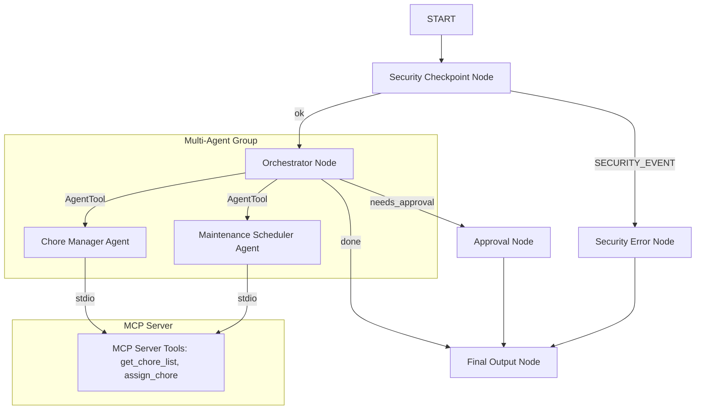

# Project Submission Write-Up: Home Keeper

## Problem Statement
Managing a household is a complex coordination problem. Homeowners and family members struggle to keep track of daily chores, allocate responsibilities fairly, monitor recurring appliance maintenance tasks (like changing HVAC filters), and take timely action when seasonal or storm warnings threaten the home (such as cleaning gutters before heavy downpours). Without centralized, intelligent coordination, chores go uncompleted, appliances degrade prematurely, and homes face preventable physical damage due to untracked maintenance.

## Solution Architecture
Home Keeper solves this by utilizing a secure, multi-agent workflow architecture that acts as an ambient coordinator.

## Concepts Used & File References
- **ADK Workflow**: Configured in [agent.py](app/agent.py#L269-L280) to orchestrate execution flow, pass state, and manage conditionals.
- **LlmAgent**: Initiated in [agent.py](app/agent.py#L59-L114) for the Orchestrator, Chore Manager, and Maintenance Scheduler sub-agents.
- **AgentTool**: Utilized in [agent.py](app/agent.py#L110-L113) to allow the Orchestrator to delegate queries to specialized sub-agents.
- **MCP Server**: Implemented using the MCP Python SDK in [mcp_server.py](app/mcp_server.py) and integrated into agents using `McpToolset` in [agent.py](app/agent.py#L34-L40).
- **Security Checkpoint**: Executed as the initial function node `security_checkpoint` in [agent.py](app/agent.py#L120-L208).
- **Agents CLI**: Scaffolded, local testing with `playground` mode (defined in the `Makefile`), and guided development.

## Security Design
The security architecture enforces three key safety controls:
1. **PII Scrubbing**: Using regular expressions, the `security_checkpoint` replaces phone numbers and email addresses with redaction tokens (`[REDACTED_PHONE]`, `[REDACTED_EMAIL]`). This prevents exposing sensitive contact information to downstream LLM contexts.
2. **Prompt Injection Mitigation**: Detects malicious patterns (such as `ignore previous instructions` or `override instructions`) and intercepts the flow immediately to route to `security_error_node`.
3. **Restricted Command Safeguard (Domain Rule)**: Certain critical commands (e.g. `wipe database`, `delete all chores`) are classified as restricted and blocked at the workflow gateway, protecting local storage.
4. **Structured JSON Audit Logs**: Every execution records a JSON log indicating the classification of the query, matching rules, and the final action taken.

## MCP Server Design
The MCP server [mcp_server.py](app/mcp_server.py) runs as a stdio subprocess and hosts 4 key tools:
- `get_chore_list()`: Fetches chores, assignee names, and completed flags from the JSON database.
- `assign_chore(task, assignee)`: Writes a chore assignment to the database.
- `get_maintenance_log()`: Fetches dates and frequencies for HVAC filters, gutter checks, and structures.
- `get_weather_forecast(city)`: Simulates real-time forecast data (e.g. triggering gutter clearing warning if storm is forecast for San Francisco).

## Human-in-the-Loop (HITL) Flow
Home Keeper implements an interactive workflow interrupt for safety-critical maintenance requests:
- When a user asks to schedule an intensive maintenance activity (e.g., `"schedule roof check"`), the `orchestrator_node` flags the request with route `needs_approval` and buffers the task context.
- The `approval_node` yields a `RequestInput` event, which triggers an interrupt in the ADK framework, pausing the run and presenting a confirmation prompt (`yes/no`) to the user.
- Upon receiving user input, the workflow resumes and either commits the change or safely declines.

## Demo Walkthrough
1. **Chore Lookup**: The user asks to see chores. The Orchestrator calls the Chore Manager, which invokes `get_chore_list` on the MCP server and prints the assignments.
2. **Security Interception**: The user inputs an adversarial command. The Security node catches the violation, logs a `CRITICAL` audit entry, and displays `Access Denied` immediately.
3. **Approval Flow**: The user requests a roof check. The UI displays an approval pop-up. The user enters `yes` and the orchestrator resumes, confirming schedule logging.

## Impact & Value Statement
Home Keeper reduces the cognitive load of home coordination by pairing structured scheduling with intelligent assistants. By introducing automated weather alerts (e.g. storm forecasts prompting gutter clearing) and enforcing PII privacy checks, it turns passive chore logs into proactive home protection tools. It serves as a blueprint for secure, ambient family organizers.
